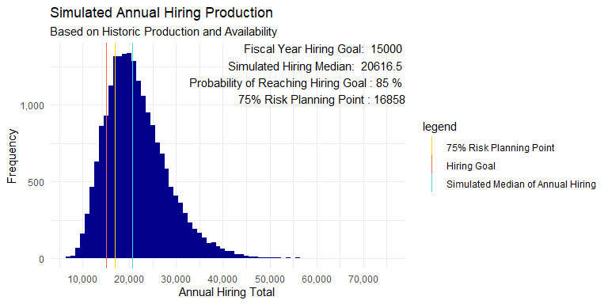
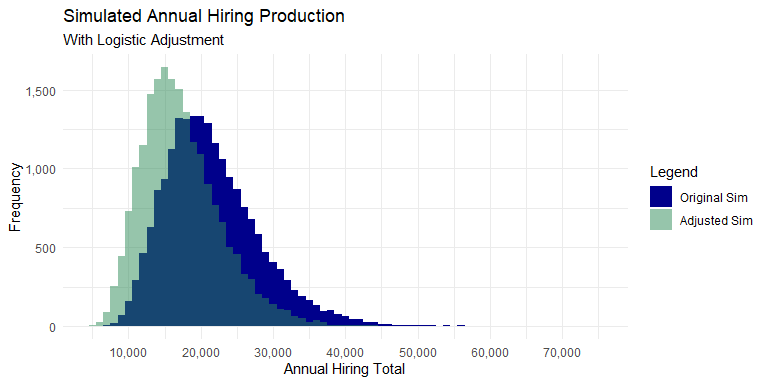
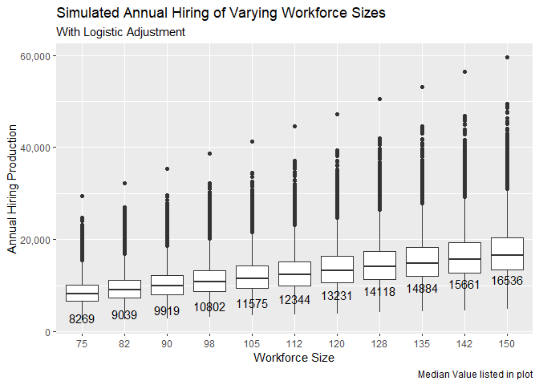

Workforce Simulation
================
Michael Czuba
2025-01-24

## Introduction

One the many variables businesses and agencies are challenged with is
balancing short term situations with longer term planning. With Human
Resource departments frequently subject to fiscal constraints, this
project showcases how leaders can utilize Monte Carlo Simulations of
productivity to optimize their talent acquisition groups for long term
success.

### Identifying Historic Parameters

The main goal of Talent Acquisition is to attract, identify, and bring
aboard the best talent. There are numerous tasks that a generalist or
specialist completes between when a candidate applies and when they come
onboard, if they come onboard.

This simulation utilizes fake data but will simulate the following
variables associated with hiring:

- Workforce Size: what is the optimal size of the department?
- Average availability of staff: Of the workforce, how often are people
  completing tasks
- Standard Deviation of Staff Availability: is there volatility or
  consistency in how available staffers are?
- Average Monthly Hires per Staffer: What is their ability to convert
  candidates to employees?
- Standard Deviation of Monthly Hires: Are hiring efforts consistent, or
  does it vary month to month?

These variables will normally be computed through an integrated HRIS
system or recruitment/time and attendance reports.

``` r
# Workforce Parameters
hiring_goal <- 15000
total_staff <- 150


# Production Parameters
average_staff_availability <- .8
stdv_staff_availability <- .05

average_monthly_hiring <- 15
stdv_monthly_hiring <-4.5
```

## Simulation

There will be 2 simulations, simulated 2 different ways:

1.  Staff availability

- Will be simulated 20 thousand times through a normal distribution.

2.  Monthly Hires

- Will be simulated 20 thousand times through a log-normal distribution.
- Seasonal hiring trends did not meet the assumption of consistent
  variance over time that is required of a poisson distribution. It has
  been my experience that hiring tends to have a positive skew to it as
  well, making log-normal an acceptable choice for the simulation.

``` r
#--Simulation of Parameters
set.seed(2025)

simulated_staff_availability <- rnorm(20000, average_staff_availability, stdv_staff_availability)

simulated_staff_available <- round(total_staff * simulated_staff_availability,0)

#-logistic adjustment 
mu<- log(average_monthly_hiring ^2 / 
           sqrt(stdv_monthly_hiring ^2 + average_monthly_hiring^2))
sigma <- sqrt(log(1+(stdv_monthly_hiring^2 / average_monthly_hiring^2)))

simulated_productivity <- rlnorm(20000,mu,sigma)
simulated_annual_hires <- round(12*simulated_staff_available * simulated_productivity,0)
```

    ## Warning: Using `size` aesthetic for lines was deprecated in ggplot2 3.4.0.
    ## ℹ Please use `linewidth` instead.
    ## This warning is displayed once every 8 hours.
    ## Call `lifecycle::last_lifecycle_warnings()` to see where this warning was
    ## generated.

<!-- --> \## Logistic
Adjustment to Annual Hiring Production

Hiring production is also not also a linear trend. As staff become less
available or the workforce size reduces, existing staffers will likely
take on additional work or face increases processing times within the
hiring actions, resulting is less completed hiring actions. If these
trends were to reverse and availability increases and or the workforce
size increases, productivity can only increase but so much. To account
for this, a logistic adjustment will be applied to the hiring totals,
allowing for the process to be more representative of its natural
occurrence. Before employing a logistic adjustment, it is best to find
the model that is most representative of the current process (not
necessarily the one listed in this code).

As seen in the overlapping simulation plots, with the logistic
adjustment applied, a steeper histogram occurs, suggesting a higher
concentration of simulated events with less variation amongst them.

``` r
threshold <- .7
alpha <- 6
adjustment <- 1/(1+exp(-alpha * (simulated_staff_availability - threshold)))
simulated_df$adjusted_hires <- round(adjustment * total_staff * simulated_productivity * 12 ,0)
```

<!-- -->

## Simulating Multiple Headcount Scenarios

To simulate the productivity of varying department sizes, multiple
headcounts have been simulated at 5% reduction intervals with their
median measure listed.

``` r
headcount_factor <- seq(.5,1, by = .05)
headcount_threshold_results <- data.frame()

for(factor in headcount_factor){
  set.seed(2038)
  simulated_productivity <- rlnorm(20000,mu,sigma)
  simulated_monthly_hires <- round(simulated_staff_available * simulated_productivity,0)
  workforce_size <- round(total_staff * factor,0)
  avail_staff_total <- round(workforce_size * adjustment,0)
  
  adjusted_annual_hires <- round(12 * avail_staff_total * simulated_productivity,0)

  temp_df <- data.frame(avail_staff_total, adjusted_annual_hires, workforce_size, simulated_productivity)
  headcount_threshold_results <- rbind(headcount_threshold_results, temp_df)
}

ggplot(headcount_threshold_results, 
       aes(as.factor(workforce_size), adjusted_annual_hires, group = workforce_size)) +
  geom_boxplot() +
  labs(
    title = 'Simulated Annual Hiring of Varying Workforce Sizes',
    subtitle = 'With Logistic Adjustment',
    x = 'Workforce Size',
    y = 'Annual Hiring Production',
    caption = 'Median Value listed in plot'
  ) +
  scale_y_continuous(labels = label_comma()) +
  stat_summary(fun = median, aes(label = round(after_stat(y))), geom = 'text', vjust = 3)
```

<!-- -->

## GLS Model for Optimzation

With the simulations of multiple headcounts set into a dataframe, a GLS
regression is conducted to generate coefficients which can then be
formatted to an optimization table in Excel, allowing for business
leaders to have the power to visualize the relationship between staffing
size and availability of staff in a less-technical, more familiar,
format.

A GLS regression was chosen due to heteroskedasticity present in an OLS
model. Applying weights in the GLS model adjusted for the difference in
variance and centering the dependent variable values removed the
multi-colliearity exhibited in the initial GLS model.

From the output:  
\* Staff Availability has a larger effect on annual hiring than
workforce size  
\* A .0091 variance estimate illustrates that variability increases
slightly as the workforce size moves further from the mean value  
\* There is a roughly 3800 hires deviation in the predictions from the
model

    ## Generalized least squares fit by REML
    ##   Model: adjusted_annual_hires ~ workforce_size_centered + staff_avail_centered 
    ##   Data: headcount_threshold_results 
    ##       AIC     BIC   logLik
    ##   4253549 4253601 -2126770
    ## 
    ## Variance function:
    ##  Structure: Exponential of variance covariate
    ##  Formula: ~(workforce_size - mean_wf_size) 
    ##  Parameter estimates:
    ##       expon 
    ## 0.009154645 
    ## 
    ## Coefficients:
    ##                             Value Std.Error   t-value p-value
    ## (Intercept)             13008.102   8.50471 1529.5176       0
    ## workforce_size_centered   115.673   0.34611  334.2059       0
    ## staff_avail_centered    18484.792 114.80518  161.0101       0
    ## 
    ##  Correlation: 
    ##                         (Intr) wrkf__
    ## workforce_size_centered 0.405        
    ## staff_avail_centered    0.000  0.000 
    ## 
    ## Standardized residuals:
    ##        Min         Q1        Med         Q3        Max 
    ## -2.6888274 -0.7045530 -0.1379322  0.5536504  7.8278818 
    ## 
    ## Residual standard error: 3820.9 
    ## Degrees of freedom: 220000 total; 219997 residual
